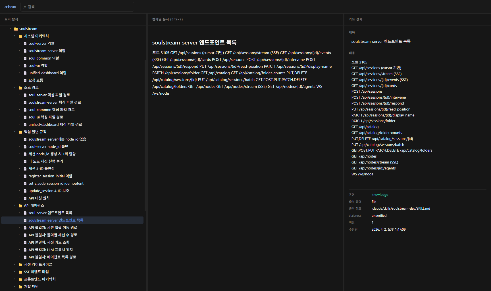

<h1 align="center">atom</h1>

<p align="center">
  <strong>A knowledge base of the agents, by the agents, for the agents.</strong>
</p>

<p align="center">
  Zettelkasten-inspired atomic knowledge cards in a tree with symlinks,<br/>
  exposed over MCP so AI agents can read, write, and reorganize knowledge directly.
</p>

<p align="center">
  
</p>

## Why atom

Most knowledge tools are built for humans first, then bolted on with an API.
atom is the opposite — **MCP is the primary interface**. The dashboard exists for oversight, but agents are the first-class citizens.

An agent can:
- **Create** a knowledge card and place it in a tree hierarchy — in one call
- **Compile** any subtree into depth-controlled markdown — perfect for context windows
- **Symlink** a card into multiple locations without duplication
- **Batch-write** dozens of creates, updates, moves, and deletes in a single atomic transaction
- **Search** by BM25 full-text across titles, content, and tags
- **Track provenance** — every card records its source, snapshot, checksum, and staleness

Humans get a React dashboard with a 3-panel layout (tree / compiled view / card detail) and real-time SSE updates. But the system is designed so an agent can operate it end-to-end without human intervention.

## Architecture

```
PostgreSQL 16
    ├── cards           — atomic knowledge units
    └── tree_nodes      — hierarchical placement (symlinks, BFS-safe)

Fastify server
    ├── REST API        — 16 endpoints, used by the dashboard
    ├── MCP HTTP        — POST /mcp, Streamable HTTP, stateless
    ├── MCP stdio       — local agent transport
    ├── Batch API       — POST /batch, atomic multi-op transactions
    └── SSE             — GET /events, real-time change stream

React dashboard
    — tree / compile / card detail panels
    — live updates via SSE (useAtomEvents hook)
    — Google OAuth authentication
```

## Data model

Two tables. Content and placement are separated by design.

**Card** — the atomic unit of knowledge:

```sql
cards (
  id, card_type ('structure' | 'knowledge'),
  title (≤50 chars), content,
  tags[], references[],
  card_timestamp, content_timestamp,
  source_type, source_ref, source_snapshot, source_checksum, source_checked_at,
  staleness ('unverified' | 'fresh' | 'stale' | 'outdated'),
  version, fts_vector (auto-generated tsvector for BM25)
)
```

**TreeNode** — where a card lives in the hierarchy:

```sql
tree_nodes (
  id, card_id → cards,
  parent_node_id → tree_nodes (self-ref, CASCADE),
  position, is_symlink,
  created_at
)
```

One card can appear in multiple tree locations via symlinks.
Deleting a card cascades all its nodes. Deleting a node preserves the card.

## MCP tools (14)

| Tool | Description |
|------|-------------|
| `create_card` | Create card + tree node in one call |
| `get_card` | Retrieve card by UUID |
| `update_card` | Partial update (content changes bump `content_timestamp`) |
| `delete_card` | Delete card and all its tree nodes |
| `get_backlinks` | Find cards that reference this card |
| `get_tree` | List root-level nodes |
| `get_node` | Single node with embedded card data |
| `list_children` | Direct children of a node |
| `compile_subtree` | BFS markdown compilation with depth control |
| `create_symlink` | Place a card at another tree location |
| `move_node` | Relocate a node to a new parent/position |
| `delete_node` | Remove node only (card preserved, children cascade) |
| `search_cards` | BM25 full-text search with snippets |
| `batch_write` | Atomic multi-operation transaction |

### batch_write

The most powerful tool. Executes creates, updates, moves, and deletes in a single PostgreSQL transaction.

- **temp_id references** — new cards can reference each other within the same batch via `temp_id` / `parent_temp_id`
- **Topological sort** — parent nodes are created before children, with cycle detection
- **Atomic** — everything succeeds or everything rolls back

### compile_subtree

Renders a subtree as markdown via BFS traversal, with configurable depth.
Symlinks follow the canonical node's children. Cycles are detected by `card_id` and marked with `*(cycle)*`.

Ideal for feeding structured knowledge into an agent's context window.

### Connecting

**Claude Desktop / Claude Code** (`claude_desktop_config.json`):

```json
{
  "mcpServers": {
    "atom": {
      "url": "https://your-domain.example.com/mcp",
      "headers": { "Authorization": "Bearer <MCP_SECRET>" }
    }
  }
}
```

**stdio** (local):

```bash
npm run mcp        # built
npm run mcp:dev    # tsx watch
```

## REST API (16 endpoints)

| Method | Path | Description |
|--------|------|-------------|
| GET | `/cards/:id` | Get card |
| POST | `/cards` | Create card (+ tree node) |
| PUT | `/cards/:id` | Update card |
| DELETE | `/cards/:id` | Delete card (cascades nodes) |
| GET | `/backlinks/:cardId` | Reverse references |
| GET | `/tree` | Root-level nodes |
| GET | `/tree/:nodeId` | Single node with card |
| GET | `/tree/:nodeId/children` | Direct children |
| GET | `/tree/:nodeId/compile` | BFS markdown (`?depth=N`, default 2) |
| POST | `/tree/symlink` | Create symlink |
| PUT | `/tree/:nodeId/move` | Move node |
| DELETE | `/tree/:nodeId` | Delete node (card preserved) |
| GET | `/search?q=` | BM25 full-text search |
| POST | `/mcp` | Streamable HTTP MCP endpoint |
| POST | `/batch` | Batch write (atomic transaction) |
| GET | `/events` | SSE real-time event stream |

Auth endpoints: `GET /api/auth/google`, `GET /api/auth/google/callback`, `GET /api/auth/status`, `POST /api/auth/logout`

## Design decisions

**Content ≠ Placement.** A card is *what you know*. A tree node is *where you put it*. This separation enables symlinks — one card, many locations, zero duplication.

**compileNode() is pure.** No DB access. Takes three callbacks (`getNodeCard`, `getChildren`, `getCard`) so the caller pre-loads data. Testable, composable, predictable.

**HTTP MCP is stateless.** Each `POST /mcp` creates a fresh `McpServer` + transport pair. The DB pool is shared with REST. No session state to manage.

**Event bus + SSE.** Every mutation emits typed events (`card:created`, `card:updated`, `card:deleted`, `node:created`, `node:deleted`, `node:moved`). The dashboard subscribes via `/events` for live updates.

**Provenance tracking.** Every card can record `source_type`, `source_ref`, `source_snapshot`, `source_checksum`, and `source_checked_at`. Combined with 4-level `staleness`, agents can audit where knowledge came from and whether it's still current.

## Getting started

```bash
docker run -d --name atom-postgres -p 5434:5432 -e POSTGRES_PASSWORD=atom postgres:16
cp .env.example .env   # fill in DATABASE_URL, API_PORT, MCP_SECRET, auth variables
npm install
npm run dev            # API on localhost:3000
```

Dashboard (optional):

```bash
cd dashboard && pnpm install && pnpm dev   # localhost:5173
```

Run tests with `npm test` (requires Docker for integration tests).
